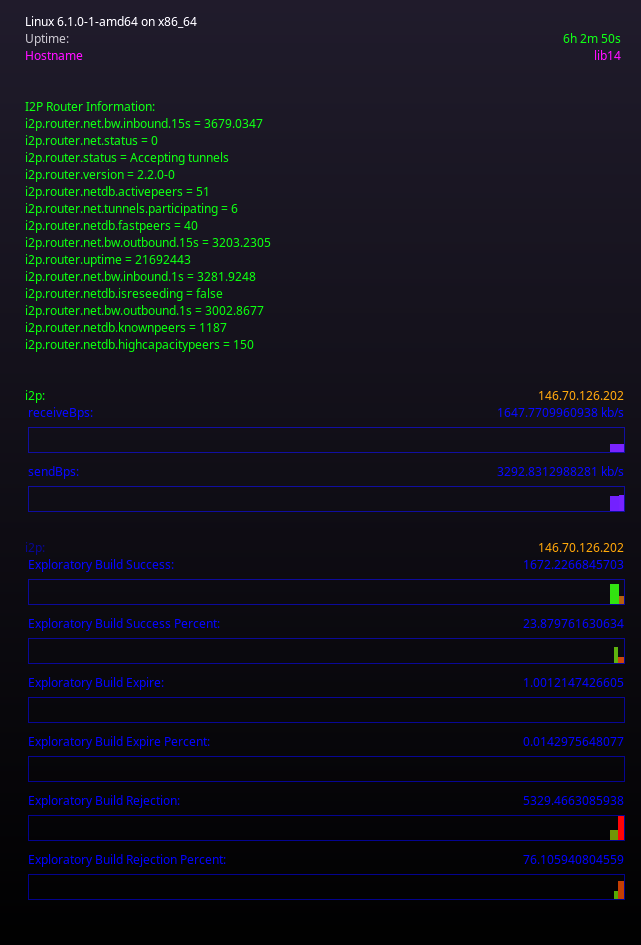
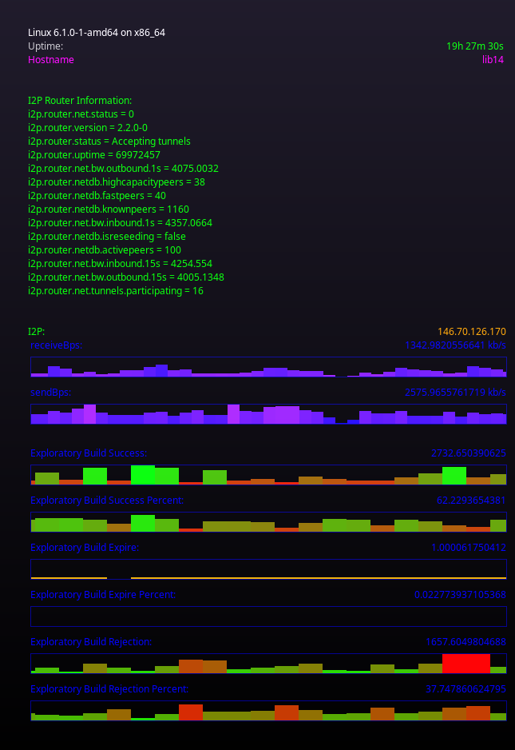

I2PControl for Lua and Conky-Lua
================================

Make sure to check out all the submodules, see: lua/README.md



```sh
# from this directory(a checkout)
conky -c _dot_conkyrc
```

```sh
# installation to $HOME/.conkyrc
mkdir -p $HOME/lua
cp -rv lua/* $HOME/lua/
cp -v _dot_conkyrc $HOME/.conkyrc
```

```sh
# usage with i2pd
export I2P_CONTROL="http://127.0.0.1:7650"
conky -c _dot_conkyrc
```

